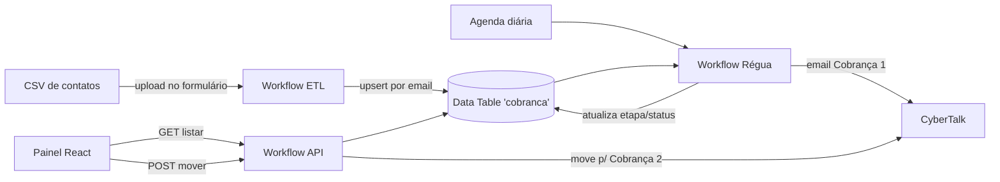

# Kard CRM — Régua educativa e de cobrança
### Documentação do sistema (n8n + front-end)

Este documento explica, em linguagem simples, como o sistema funciona de ponta a ponta:
o que cada workflow do n8n faz, etapa por etapa, como os dados fluem, e como versionar
tudo no GitHub.

---

## 1. Visão geral

O sistema é uma **régua de relacionamento e cobrança**: o contato entra numa fase
educativa (lembrete antes/no vencimento) e evolui para cobrança. O **n8n é o back-end**
(dados + automações) e um **app React** é o painel visual (front-end).

Fluxo geral:



As **3 etapas** do contato:

1. **Educativo** — lembrete amigável (no/antes do vencimento).
2. **Cobrança 1** — primeira cobrança. A passagem de Educativo → Cobrança 1 é **automática**, por data.
3. **Cobrança 2** — cobrança mais firme. A passagem Cobrança 1 → Cobrança 2 é **manual** (uma pessoa move o card no painel), e ao mover, o email é disparado.

---

## 2. Modelo de dados — Data Table `cobranca`

É a "fonte da verdade" do sistema. Cada linha é um contato. Colunas:

| Coluna | Tipo | Para que serve |
|---|---|---|
| `nome` | texto | Nome do contato (usado no email) |
| `email` | texto | Email de destino (chave de deduplicação) |
| `empresa` | texto | Empresa do contato |
| `valor` | número | Valor em aberto (R$) |
| `vencimento` | data | Data de vencimento — dispara a régua |
| `etapa` | texto | Educativo / Cobranca 1 / Cobranca 2 |
| `status_envio` | texto | enviado / falha (último disparo) |
| `cbtk_id` | texto | ID retornado pela CyberTalk no disparo |
| `ultimo_envio` | data | Quando foi o último disparo |

O `email` ser único é o que garante o **dedupe**: reimportar a mesma pessoa atualiza a
linha em vez de duplicar.

---

## 3. Os workflows do n8n (etapa por etapa)

### 3.1. `IA - Cobrança - ETL CSV` (importação)

Porta de entrada dos contatos. Dispara quando alguém envia um CSV pelo formulário.

1. **Upload CSV** (Form Trigger) — gera uma página web com um campo de upload. Aceita `.csv`.
2. **Ler CSV** (Extract from File) — transforma o arquivo em linhas (uma por contato).
3. **Normalizar** (Code) — limpa e padroniza cada linha:
   - email em minúsculo e validado (linhas com email inválido são descartadas);
   - `valor` convertido para número (aceita formato BR, ex.: `1.234,56`);
   - `vencimento` convertido para data ISO (aceita `dd/mm/aaaa`);
   - define `etapa = Educativo`.
4. **Upsert cobranca** (Data Table) — grava na tabela casando por `email`: se já existe, atualiza; se não, cria.

**Colunas esperadas no CSV:** `nome, email, empresa, valor, vencimento`.

### 3.2. `IA - Cobrança - Régua` (automação agendada)

O coração da automação. Move Educativo → Cobrança 1 **por data** e dispara o email.

1. **Agenda** (Schedule Trigger) — roda no horário configurado (hoje: todo dia às 9h).
   *A própria pessoa pode mudar para "todo mês no dia 20", etc., nesse nó.*
2. **Config** (Set) — guarda num lugar só os parâmetros: URL da CyberTalk, IDs (rede,
   assistente, conta de email) e `dias_apos_vencimento` (0 = no dia do vencimento; 5 = D+5).
3. **Ler cobranca (Educativo)** (Data Table) — busca todos os contatos na etapa Educativo.
4. **Elegíveis por data** (Code) — mantém só quem já passou de `vencimento + dias_apos_vencimento`
   e monta o HTML do email (verde Kard, com nome e valor).
5. **Disparar Cobrança 1** (HTTP Request) — envia o email pela API da CyberTalk.
6. **Marcar Cobrança 1** (Data Table) — atualiza a linha: `etapa = Cobranca 1`,
   `status_envio`, `cbtk_id`, `ultimo_envio`.

### 3.3. `IA - Cobrança - API` (back-end do painel)

Expõe a Data Table para o front-end, com CORS liberado.

- **GET `/webhook/crm-cobranca/list`** — `GET listar` → `Ler tudo` (Data Table) →
  `Responder lista`. Devolve todos os contatos em JSON. É o que o painel lê.
- **POST `/webhook/crm-cobranca/update`** — `POST mover` → `Atualizar etapa` (Data Table)
  → `E Cobrança 2?` (IF):
  - Se a nova etapa for **Cobrança 2**: `Montar email Cob2` (Code) → `Disparar Cobrança 2`
    (HTTP/CyberTalk) → responde. Ou seja, mover para Cobrança 2 **dispara o email**.
  - Senão: só responde (só muda a etapa).

### 3.4. Workflows de email (base)

- `IA - CyberTalk - Email` — o disparo base via CyberTalk que validamos primeiro
  (resolveu o problema de SSL: a opção *Ignore SSL Issues*, equivalente ao `verify=False` do Python).
  Serviu de referência para os disparos da régua e da API.

---

## 4. O front-end (painel)

App em **React + Vite** (pasta `kard-crm-cobranca/`), em tons de verde da Kard:

- Lê os contatos via `GET .../crm-cobranca/list` e mostra em 3 colunas (Educativo, Cobrança 1, Cobrança 2).
- Mostra métricas (contatos, valor em aberto, em cobrança) e busca.
- Mover um card chama `POST .../crm-cobranca/update`. Ao mover para **Cobrança 2**, o n8n dispara o email.
- A URL da API fica em `VITE_N8N_BASE` (variável de ambiente), com um valor padrão embutido no código.

Deploy: GitHub → Vercel (preset Vite). Cada push na branch `main` gera um deploy novo.

---

## 5. Como versionar o n8n no GitHub

Os workflows do n8n são arquivos JSON — dá para guardá-los no mesmo repositório.

### Opção A — Export / Import (recomendada, simples)

1. No n8n, abra cada workflow → menu **⋯** (canto superior direito) → **Download**.
   Isso baixa um `.json` com todos os nós e conexões.
2. Crie uma pasta `n8n/` no repositório e coloque os arquivos, por exemplo:
   - `n8n/ia-cobranca-etl-csv.json`
   - `n8n/ia-cobranca-regua.json`
   - `n8n/ia-cobranca-api.json`
3. Versione normalmente:
   ```bash
   git add n8n/
   git commit -m "Exporta workflows do n8n"
   git push
   ```
4. Para **restaurar** num n8n: *Workflows → ⋯ → Import from File* e selecione o JSON.

> Importante: o JSON exportado **não** inclui segredos de credenciais (só a referência).
> Tokens/keys continuam guardados com segurança no n8n.

### Opção B — Source Control nativo do n8n (Git)

No plano Enterprise, o n8n tem *Settings → Source Control*: você conecta um repositório Git
e ele sincroniza os workflows automaticamente (push/pull). Não precisa exportar à mão.

### Opção C — Workflow as Code (SDK)

Os workflows aqui foram criados via o **SDK do n8n** (código TypeScript que descreve nós e
conexões). Dá para manter esse código no repo e recriar os workflows a partir dele — é o mais
"de engenharia", porém exige mais familiaridade.

---

## 6. Manutenção rápida (onde mexer)

| Quero... | Onde mexer |
|---|---|
| Mudar quando a régua roda (ex.: dia 20) | Nó **Agenda** do workflow Régua (Trigger Interval) |
| Mudar quando cobra (D+5, D+10...) | Campo `dias_apos_vencimento` no nó **Config** da Régua |
| Editar o texto/visual do email | Nós **Code** (`Elegíveis por data` e `Montar email Cob2`) |
| Trocar a conta/IDs da CyberTalk | Nó **Config** (Régua) e nós HTTP de disparo |
| Mudar a URL da API no painel | Variável `VITE_N8N_BASE` no Vercel (ou o padrão no `src/App.jsx`) |

---

## 7. Próximos passos sugeridos

- **Anti-reenvio**: garantir que a régua não dispare duas vezes para o mesmo contato/etapa.
- **Snov.io**: validar/enriquecer o email antes do disparo.
- **Autenticação**: proteger os webhooks e o painel antes de uso amplo (hoje a API está com CORS aberto).
- **Limpeza**: remover as linhas de teste da Data Table antes de subir os dados reais.