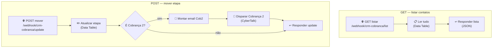

# Workflow: IA - Cobrança - API

**Arquivo:** [`../workflows/ia-cobranca-api.json`](../workflows/ia-cobranca-api.json)
**O que é:** o **back-end do painel React**. Expõe a tabela `cobranca` por **webhooks** (com CORS liberado) para o front-end conseguir **listar** os contatos e **mover** a etapa de um card.

Tem **dois caminhos independentes** dentro do mesmo workflow: um para `GET` (listar) e um para `POST` (mover).

---

## Fluxo



---

## Os dois endpoints

### 🟢 `GET /webhook/crm-cobranca/list`
Devolve **todos os contatos** da tabela em JSON. É o que o painel chama ao carregar.

| Nó | Tipo | Faz |
|---|---|---|
| **GET listar** | Webhook (GET) | Recebe a chamada. CORS liberado (`allowedOrigins: *`) |
| **Ler tudo** | Data Table | Lê todas as linhas da tabela `cobranca` |
| **Responder lista** | Respond to Webhook | Devolve o JSON com header `Access-Control-Allow-Origin: *` |

### 🟡 `POST /webhook/crm-cobranca/update`
Move um contato de etapa. O corpo (body) precisa ter o **`id`** do contato e a **`etapa`** nova.

```json
{ "id": "123", "etapa": "Cobranca 2" }
```

| Nó | Tipo | Faz |
|---|---|---|
| **POST mover** | Webhook (POST) | Recebe a chamada com `{ id, etapa }` |
| **Atualizar etapa** | Data Table | Atualiza a `etapa` da linha com aquele `id` |
| **E Cobrança 2?** | IF | Verifica se a nova etapa é `Cobranca 2` |
| **Montar email Cob2** | Code | (só se for Cob2) monta o email mais firme |
| **Disparar Cobrança 2** | HTTP Request | (só se for Cob2) envia o email via CyberTalk |
| **Responder update** | Respond to Webhook | Devolve a resposta ao painel |

> 💡 **A regra de ouro:** mover um card para **Cobrança 2 dispara o email** de Cobrança 2. Mover para qualquer outra etapa só muda o status, sem enviar nada.

---

## URLs (produção)

Base do n8n: `https://n8n.srv1759869.hstgr.cloud/`

- Listar: `https://n8n.srv1759869.hstgr.cloud/webhook/crm-cobranca/list`
- Mover: `https://n8n.srv1759869.hstgr.cloud/webhook/crm-cobranca/update`

É essa base que o front-end usa na variável `VITE_N8N_BASE`.

---

## Onde mexer

| Quero... | Onde |
|---|---|
| Mudar o texto/visual do email de Cobrança 2 | nó **Montar email Cob2** |
| Trocar a chave/IDs da CyberTalk | nó **Disparar Cobrança 2** |
| Mudar qual etapa dispara email | nó **E Cobrança 2?** (a condição) |
| Restringir quem pode chamar (CORS) | nós **GET listar** / **POST mover** (`allowedOrigins`) |

---

## ⚠️ Atenção — segurança

Hoje os webhooks estão **abertos** (CORS `*`, sem autenticação). Qualquer um que descobrir a URL pode listar contatos e mover etapas (disparando emails). Antes de uso amplo, vale **proteger** (ex.: um token/segredo no header). Está nos "próximos passos" do projeto.

🔴 A chave `x-cbtk-key` no JSON deste repositório está como `__CBTK_KEY__` (removida). No n8n precisa ser a chave real.

---

## Detalhes técnicos

- **Data Table:** `cobranca` (id `vwWbTJOAkbxCbhzw`)
- **Triggers:** 2 webhooks (GET e POST)
- **CORS:** liberado para todos (`*`)
