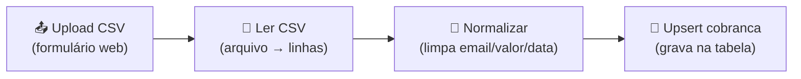

# Workflow: IA - Cobrança - ETL CSV

**Arquivo:** [`../workflows/ia-cobranca-etl-csv.json`](../workflows/ia-cobranca-etl-csv.json)
**O que é:** a **porta de entrada** dos contatos. Alguém envia um CSV num formulário e os contatos entram na tabela `cobranca`, já na etapa **Educativo**.

> "ETL" = **E**xtract (ler o arquivo), **T**ransform (limpar/padronizar), **L**oad (gravar na tabela).

---

## Fluxo



---

## Nó por nó

### 1. Upload CSV — *Form Trigger*
Gera uma **página web** com um campo de upload (aceita só `.csv`). Quando alguém envia o arquivo, o workflow começa.
- Caminho do formulário: `importar-cobranca`
- Mensagem de confirmação: *"Arquivo recebido! Os contatos estão sendo importados para o pipeline."*

### 2. Ler CSV — *Extract from File*
Transforma o arquivo CSV em **linhas** (uma por contato). Usa a primeira linha como cabeçalho (`headerRow: true`).

### 3. Normalizar — *Code (JavaScript)*
O "faxineiro" dos dados. Para cada linha:
- **Email** → vira minúsculo e é **validado**. Linha com email inválido é **descartada**.
- **Valor** → converte texto em número, aceitando formato brasileiro (ex.: `1.234,56` vira `1234.56`).
- **Vencimento** → converte `dd/mm/aaaa` para data ISO (`aaaa-mm-dd`).
- Define **`etapa = Educativo`** para todo mundo que entra.

### 4. Upsert cobranca — *Data Table*
Grava na tabela `cobranca` casando pela coluna **`email`**:
- Se o email **já existe** → **atualiza** a linha.
- Se **não existe** → **cria** uma nova.

É isso que evita duplicados (o famoso "upsert" = update + insert).

---

## CSV de entrada — formato esperado

Colunas (a primeira linha precisa ter esses nomes):

```csv
nome,email,empresa,valor,vencimento
Maria Souza,maria@exemplo.com,Acme,1.234,56,10/07/2026
```

| Coluna | Exemplo | Observação |
|---|---|---|
| `nome` | Maria Souza | usado no email |
| `email` | maria@exemplo.com | **chave** — define duplicados; inválido é descartado |
| `empresa` | Acme | opcional |
| `valor` | 1.234,56 | aceita formato BR |
| `vencimento` | 10/07/2026 | `dd/mm/aaaa` |

---

## Onde mexer

| Quero... | Onde |
|---|---|
| Mudar o texto/título do formulário | nó **Upload CSV** |
| Aceitar outro nome de coluna no CSV | nó **Normalizar** (no código JS) |
| Mudar regra de validação de email/valor/data | nó **Normalizar** |
| Trocar a tabela de destino | nó **Upsert cobranca** (`dataTableId`) |

---

## Detalhes técnicos

- **Data Table:** `cobranca` (id `vwWbTJOAkbxCbhzw`)
- **Trigger:** Form (não tem agenda; roda quando alguém envia o CSV)
- **Etapa inicial gravada:** `Educativo`
