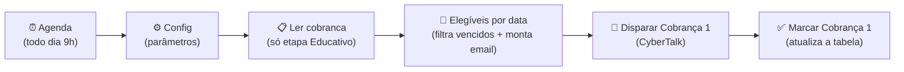

# Workflow: IA - Cobrança - Régua

**Arquivo:** [`../workflows/ia-cobranca-regua.json`](../workflows/ia-cobranca-regua.json)
**O que é:** o **coração da automação**. Todo dia, no horário marcado, ele olha quem está em **Educativo**, vê quem já passou do vencimento, **dispara o email de Cobrança 1** e move essas pessoas para a etapa **Cobrança 1**.

> A passagem **Educativo → Cobrança 1 é automática** (por data). Quem faz isso é este workflow.

---

## Fluxo

---

## Nó por nó

### 1. Agenda (diário 9h) — *Schedule Trigger*
Dispara o workflow **todo dia às 9h00**. É aqui que você muda a frequência (ex.: "todo dia 20 do mês").

### 2. Config — *Set*
Guarda num lugar só os parâmetros usados adiante. Mexer aqui evita caçar valor espalhado:

| Parâmetro | Valor atual | Para que serve |
|---|---|---|
| `dias_apos_vencimento` | `0` | Quantos dias após o vencimento começa a cobrar. `0` = no dia; `5` = D+5 |
| `cbtkUrl` | URL da API CyberTalk | Endpoint de disparo |
| `redeId` | (UUID) | ID da rede na CyberTalk |
| `assistenteVirtualId` | (UUID) | ID do assistente virtual |
| `contaEmailId` | (UUID) | Conta de email usada para enviar |

### 3. Ler cobranca (Educativo) — *Data Table*
Busca **todos** os contatos cuja `etapa = Educativo`. Só esses são candidatos a virar Cobrança 1.

### 4. Elegíveis por data — *Code (JavaScript)*
Filtra e prepara. Para cada contato em Educativo:
- Calcula `vencimento + dias_apos_vencimento`. Se **hoje ainda não chegou nessa data**, **pula** (continua em Educativo).
- Para os elegíveis, monta o **HTML do email** (visual verde Kard, com nome e valor formatado em R$) e o assunto *"Lembrete: sua fatura venceu"*.

### 5. Disparar Cobrança 1 — *HTTP Request*
Faz `POST` para a API da CyberTalk, enviando o email montado.
- **SSL:** usa `allowUnauthorizedCerts: true` (equivale ao `verify=False` do Python — foi o que resolveu o problema de SSL).
- **`neverError` + `onError: continueRegularOutput`:** mesmo se um envio falhar, o workflow **não para** — segue para o próximo nó e registra a falha.
- 🔴 A chave `x-cbtk-key` neste repositório está como `__CBTK_KEY__` (removida por segurança). No n8n ela precisa ser a chave real.

### 6. Marcar Cobrança 1 — *Data Table*
Atualiza a linha do contato na tabela:
- `etapa = Cobranca 1`
- `status_envio = enviado` ou `falha` (conforme o disparo)
- `cbtk_id` = id retornado pela CyberTalk
- `ultimo_envio` = data/hora de agora

---

## Onde mexer (as perguntas mais comuns)

| Quero... | Onde |
|---|---|
| Mudar **quando** roda (ex.: dia 20) | nó **Agenda** |
| Mudar **quando cobra** (D+0, D+5, D+10...) | `dias_apos_vencimento` no nó **Config** |
| Editar **texto/visual** do email | nó **Elegíveis por data** (o HTML está no código) |
| Trocar conta/IDs da CyberTalk | nó **Config** |
| Trocar a chave da CyberTalk | nó **Disparar Cobrança 1** (header `x-cbtk-key`) |

---

## ⚠️ Atenção (do "próximos passos" do projeto)

Hoje **não há trava de reenvio dentro da etapa**: o filtro funciona porque, ao disparar, o contato sai de Educativo e vira Cobrança 1 (então não é relido no dia seguinte). Mas se algo reverter a etapa para Educativo, ele pode ser cobrado de novo. Vale implementar o **anti-reenvio** (ex.: checar `ultimo_envio`).

---

## Detalhes técnicos

- **Data Table:** `cobranca` (id `vwWbTJOAkbxCbhzw`)
- **Trigger:** Schedule (diário, 9h)
- **Move:** `Educativo → Cobranca 1`
